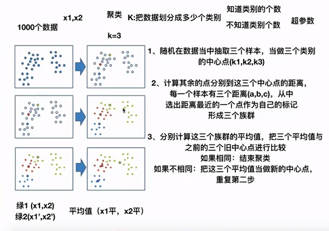
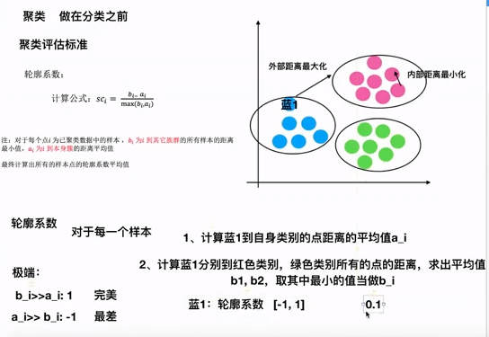

# 一、算法步骤
在数据分类之前，已知数据的特征值和需要划分为几个类别，可以使用k-means算法进行聚类。步骤如下：
1. 随机在数据当中抽取三个样本，当做三个类别的中心点。（k1，k2，k3）
2. 计算其余的点，分别到这三个中心点的距离，每一个样本有三个距离（a，b，c）从中选出距离最近的一个点作为自己的标记，形成三个族群。
3. 分别计算这三个族群的平均值，把三个平均值与之前的三个旧中心点进行比较。如果相同：结束聚类；如果不相同：把这三个平均值当做新的中心点，重复第二步骤。  

图如下：  

# 二、聚类评估标准-轮廓系数
聚类完成后不知聚类效果如何可使用轮廓系数进行评估，轮廓系数是针对每一个样本（即，图中的每一个点）
算法步骤：
1. 计算蓝1到自身类别的点距离的平均值a_i。
2. 计算蓝1分别到红色类别和绿色类别所有的点的距离，求出平均值b1、b2，取其中最小的值当做b_i。  
系数公式如下：  
  
在最好的情况下：`b_i>>a_i`系数等于1；在最差的情况下：`a_i>>b_i`系数等于-1。
则轮廓系数的系数在`-1～1`之间。越靠近1效果越好。
# 三、python代码

# 四、总结
特点：采用迭代式算法，直观易懂并且使用。
缺点：容易收敛到局部最优解（多次聚类）。
注意：聚类一般做在分类之前。
