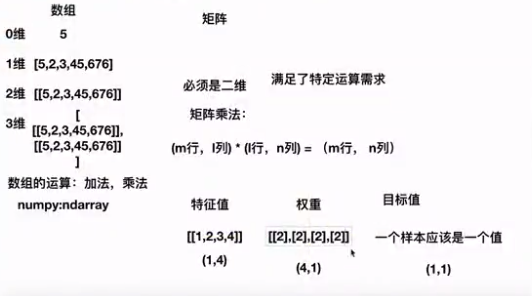
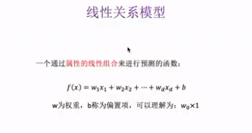
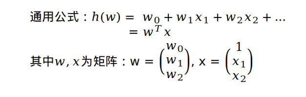
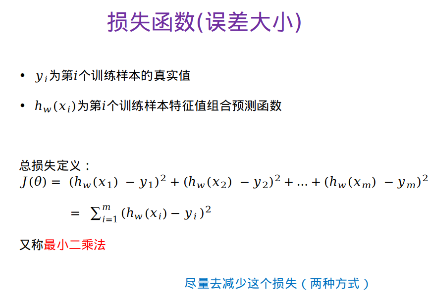
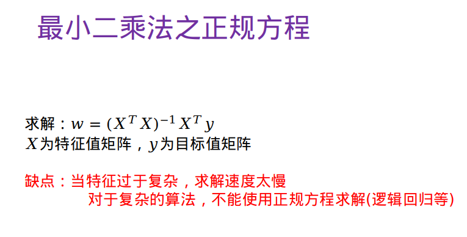
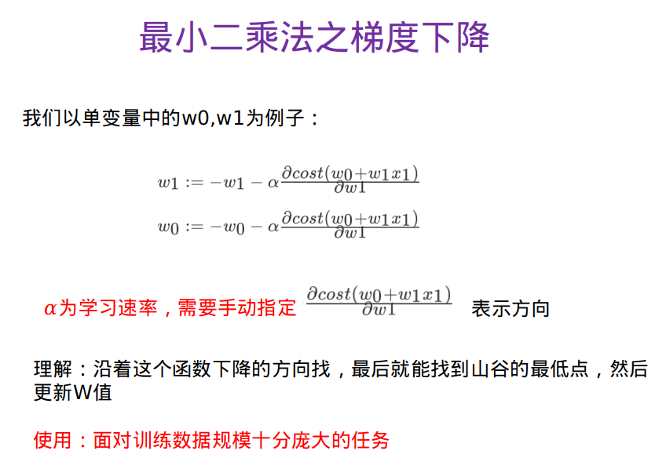

# 一、算法
## 1、数组与矩阵
矩阵必须是二维，为了满足特定运算需求。矩阵乘法公式：
```
(m行,i列)*(i行,n列)=(m行,n列)
```
在计算线性回归模型数据时会有很大用途。如下图：

  
### python代码
**数组相乘**
```
import numpy as np
a=[[1,2,3,4],[5,6,7,8],[4,5,2,3]]
b=[2,2,2,2]
np.multiply(a,b)

Out: 
array([[ 2,  4,  6,  8],
       [10, 12, 14, 16],
       [ 8, 10,  4,  6]])

```
**矩阵相乘**
```
import numpy as np
a=[[1,2,3,4],[5,6,7,8],[4,5,2,3]]
b=[[2],[2],[2],[2]]
np.dot(a,b)

Out: 
array([[20],
       [52],
       [28]])

```

## 2、线性模型

**如何是一个回归问题：** 目标值是连续性的值。

**作用：** 寻找一种能预测的趋势。 

**线性关系模型，在二维中是直线关系，三维立体中是平面关系。**  
**基本公式：`y=kx + b`，线性回归是为了找到k值**

## 线性关系模型如下图：  
  
**b：偏置，作用：为了是对与单个特征的情况更加通用**

## 3、线性回归
## 定义
线性回归通过一个或者多个**自变量**与**因变量**之间进行建模的回归分析，其中可以为**一个或多个自变量之间的线性组合（线性回归的一种）**  
一元线性回归：涉及的变量只有一个。  
多元线性回归：涉及的变量为两个或两个以上。

## 线性回归公式，如下图：
  

# 二、策略（损失函数）
预测结果与真实值是有一定的误差
## 误差平方和最小二乘法
  

# 三、优化
## 1、正规方程
  

## 2、梯度下降



# 四、python代码
通过特征值和目标值计算出，公式线性回归中`w`值，从而预测某种结果。
```
from sklearn.datasets import load_boston
from sklearn.linear_model import LinearRegression,SGDRegressor
from sklearn.model_selection import train_test_split
from sklearn.preprocessing import StandardScaler

# 获取数据（波士顿房子价格）
lb = load_boston()
# 分割数据集到训练集和测试集
x_train,x_test,y_train,y_test = train_test_split(lb.data,lb.target,test_size=0.25)
# 标准化处理
# 特征值和目标值都必须标准化
std_x=StandardScaler()
x_train = std_x.fit_transform(x_train)
x_test = std_x.fit_transform(x_test)
# 目标值
std_y=StandardScaler()
y_train = std_y.fit_transform(y_train.reshape(-1,1))
y_test = std_y.fit_transform(y_test.reshape(-1,1))
# estimator预测
# 正规方程预测结果
lr = LinearRegression()
lr.fit(x_train,y_train)
# 训练得出w值
print(lr.coef_)
# inverse_transform把标准化化后的数据转换为真实数据
y_predict = std_y.inverse_transform(lr.predict(x_test))
print("测试集里每个样本预测的价格：",y_predict)
```
# 五、欠拟合、过拟合
问题：训练的数据训练的很好，误差也不大，为什么在测试集上面有问题？  
模型复杂的原因：数据的特征和目标值之间的关系不仅仅是线性关系  
通过结果现象判断：欠拟合、过拟合  
判断：欠拟合训练数据得出结果效果不好，测试结果效果也不好。过拟合训练数据得出结果效果很好，测试结果效果不好。  

**`欠拟合`**  
**原因：** 学习到数据的特征较少  
**解决方法：** 增加数据的特征数量  
**`过拟合`**  
**原因：** 原始特征过多，存在一些嘈杂特征，模型过于复杂是因为模型尝试去兼顾各个测试数据点。  
**解决方法：** 
1. 进行特征选择，消除关联性大的特征（很难做）
2. 交叉验证（让所有数据都有过训练）
3. 正则化（了解）

# 六、岭回归分析

L2正则化（岭回归）：作用：可以使得w的每个元素都很小，都接近于0，优点：越小的参数说明模型越简单，越简单的模型则越不容易产生过拟合现象


第四章视频没有看

```
joblib.dump(rf,'test.pkl')
joblib.load('test.pkl')
```


