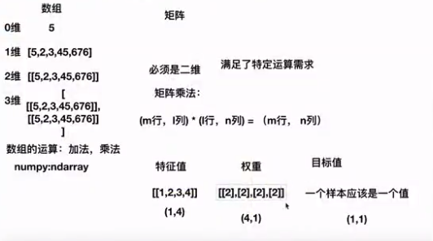
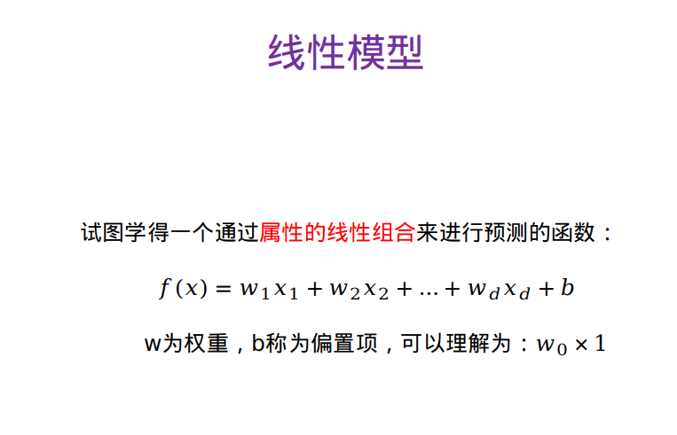
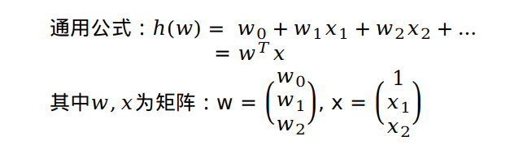

# 一、数组与矩阵
矩阵必须是二维，为了满足特定运算需求。矩阵乘法公式：
```
(m行,i列)*(i行,n列)=(m行,n列)
```
在计算线性回归模型数据时会有很大用途。如下图：

  
## python代码
**数组相乘**
```
import numpy as np
a=[[1,2,3,4],[5,6,7,8],[4,5,2,3]]
b=[2,2,2,2]
np.multiply(a,b)

Out: 
array([[ 2,  4,  6,  8],
       [10, 12, 14, 16],
       [ 8, 10,  4,  6]])

```
**矩阵相乘**
```
import numpy as np
a=[[1,2,3,4],[5,6,7,8],[4,5,2,3]]
b=[[2],[2],[2],[2]]
np.dot(a,b)

Out: 
array([[20],
       [52],
       [28]])

```

# 二、线性回归模型

**如何是一个回归问题：** 目标值是连续性的值。

**作用：** 寻找一种能预测的趋势。 

**线性关系模型，在二维中是直线关系，三维立体中是平面关系。**  
**基本公式：`y=kx + b`，线性回归是为了找到k值**

## 线性关系模型如下图：  
  
**b：偏置，作用：为了是对与单个特征的情况更加通用**

# 三、线性回归
## 定义
线性回归通过一个或者多个**自变量**与**因变量**之间进行建模的回归分析，其中可以为**一个或多个自变量之间的线性组合（线性回归的一种）**  
一元线性回归：涉及的变量只有一个。  
多元线性回归：涉及的变量为两个或两个以上。

## 线性回归公式，如下图：
  


k-means 和 线性回归 代码 


