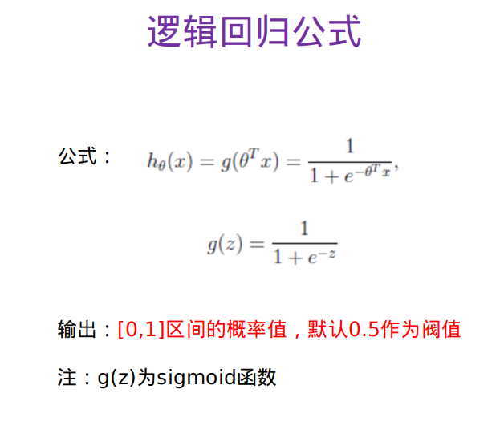
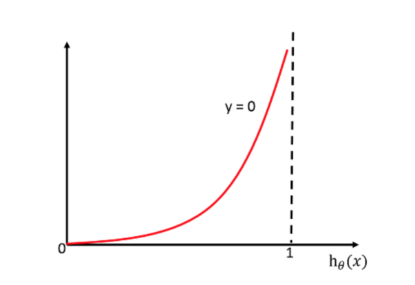

# 一、算法
## 1.逻辑回归  
**作用:** 解决二分类问题，例如：
- 广告点击率
- 判断用户的性别
- 预测用户是否会购买给定的商品类
- 判断一条评论是正面的还是负面的  

逻辑回归以线性回归的式子作为输入
  

## 2.sigmoid函数
  
x轴是具体的值，y轴0～1之间的值（概率值），函数y轴交叉的值为0.5

## 3.逻辑回归公式
  
其中`g(z)`是sigmoid函数，`e`为常数2.71，-z中的z为线性回归的结果。
# 二、策略（损失函数）及优化
与逻辑回归原理相同，但由于是分类问题，损失函数不一样，只能通过梯度下降求解。
## 对数似然损失
  
其中`h0(x)`为损失概率值  
  
-log(P)图形，如果目标值是1类，预测属于1类的概率为100%，即没有损失。  
 
如果目标值是0类，预测属于1类的概率为0%，即损失率为100%。  
逻辑回归只判断一个类别属于的概率。
## 完整的损失函数
  

  

## 与线性回归损失函数梯度下降对比
<!-- **损失函数对比** -->
  

# 三、python代码
```
import pandas as pd
import numpy as np
from sklearn.model_selection import train_test_split
from sklearn.preprocessing import StandardScaler
from sklearn.linear_model import LogisticRegression
from sklearn.metrics import classification_report

# 逻辑回归做二分类进行癌症预测
column_names=['Sample code number','Clump Thickness', 'Uniformity of Cell Size','Uniformity of Cell Shape','Marginal Adhesion','Single Epithelial Cell Size','Bare Nuclei','Bland Chromatin','Normal Nucleoli','Mitoses','Class']
data = pd.read_csv("https://archive.ics.uci.edu/ml/machine-learning-databases/breast-cancer-wisconsin/breast-cancer-wisconsin.data",names=column_names)
# 缺失值处理
data = data.replace(to_replace='?',value=np.nan)
data = data.dropna()

# 进行数据分割
x_train,x_test,y_train,y_test = train_test_split(data[column_names[1:10]],data[column_names[10]],test_size=0.25)
# 进行标准化处理
std = StandardScaler()
x_train = std.fit_transform(x_train)
x_test = std.transform(x_test)
lg = LogisticRegression(C=1.0)
lg.fit(x_train,y_train)
y_predict = lg.predict(x_test)
print(lg.coef_)
print("准确率：",lg.score(x_test,y_test))
print("召回率：",classification_report(y_test,y_predict,labels=[2,4],target_names=["良性","恶性"]))
```
# 四、总结
应用：广告点击率预测、电商购物搭配推荐  
优点：适合需要得到一个分类概率的场景  
缺点：当特征空间很大时，逻辑回归的性能不是很好（看硬件能力）


