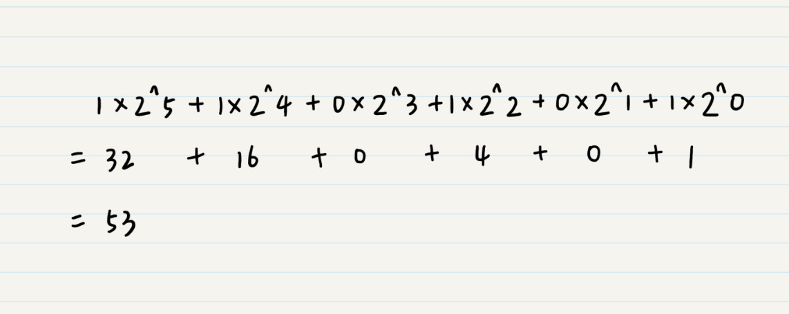
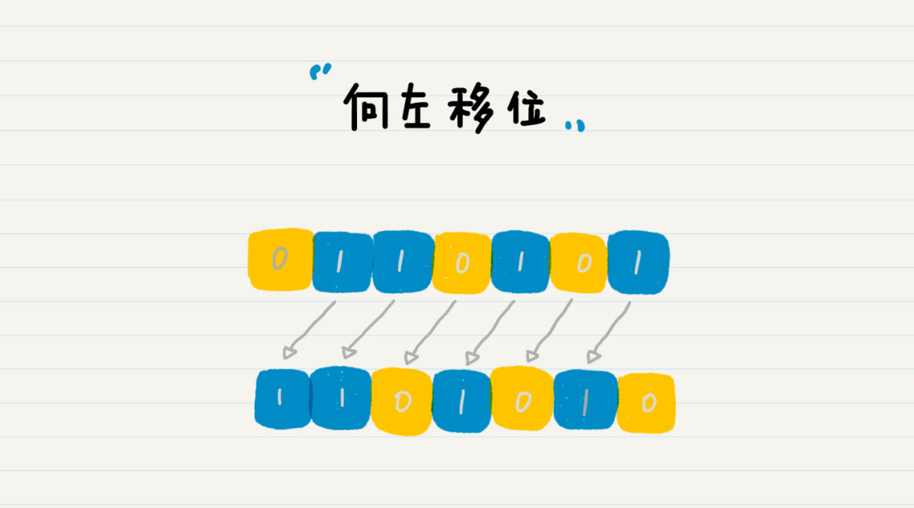
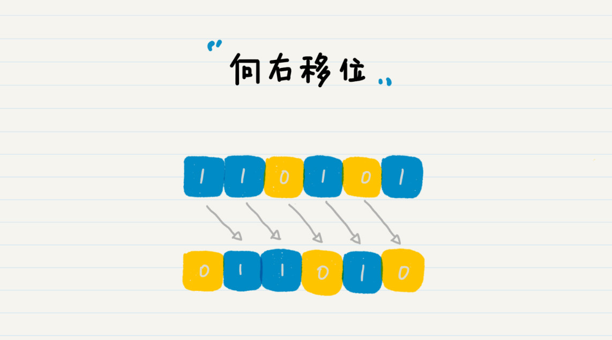
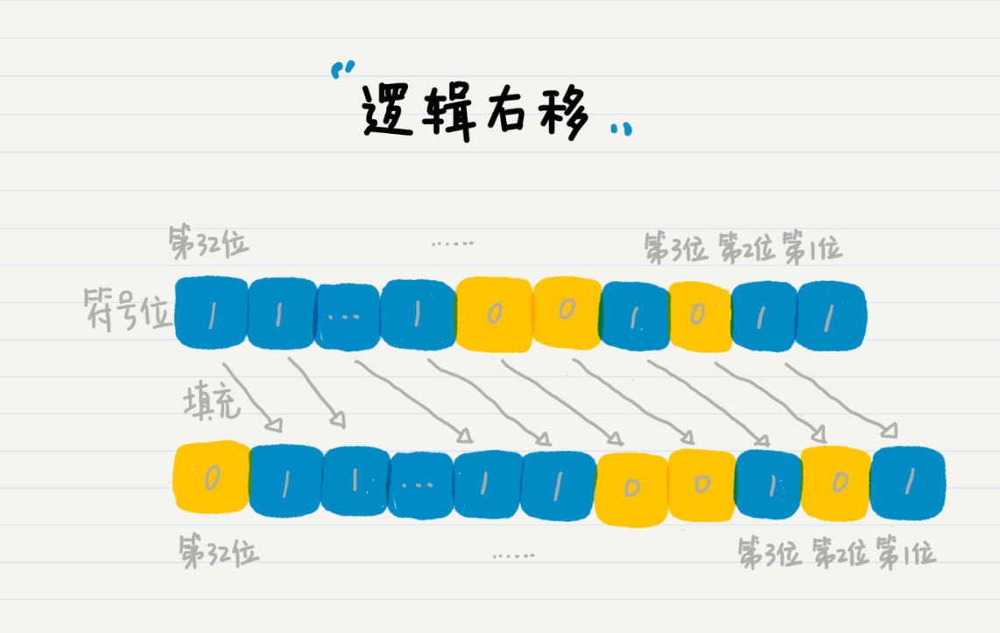
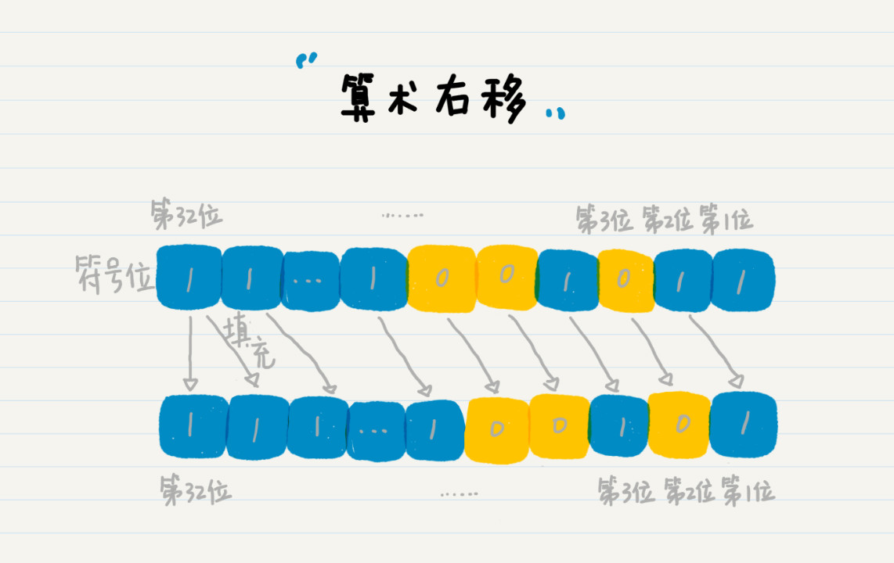
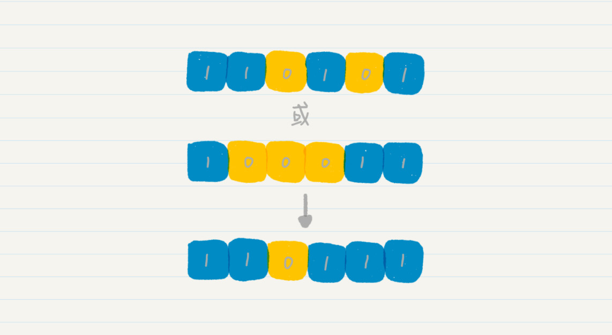
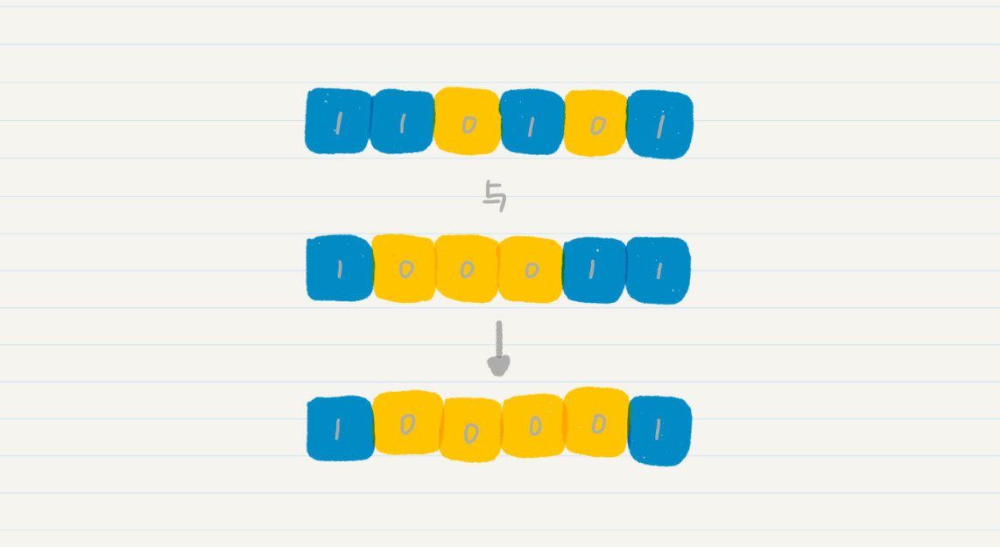
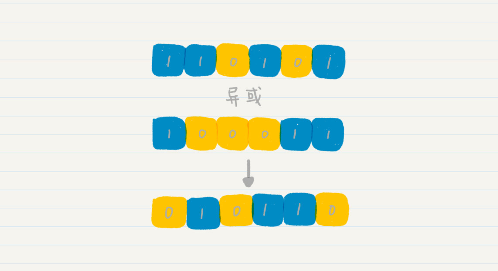

# 一、什么是二进制
二进制数据：110101，转为我们看到的数字为53，具体过程：  
二进制的数位就是 2^n 的形式  

# 二、二进制的位操作
二进制左移一位，其实就是将数字翻倍。  

二进制右移一位，就是将数字除以 2 并求整数商的操作。

# 三、java中的位操作（所有语言大似相同）
num-等待移位的十进制数, m- 向右移的位数，结果移位后的十进制数
向左移位
`num << m`
向右移位（逻辑右移）
`num >>> m`
# 四、逻辑右移和算术右移
以在32位系统中二进制为110101，十进制为53举例，呈现如图：

-53呈现为（正数的补位）：

在32位系统中，从右往左数第32位是0的为正数，为1的是负数。  
那么这个时候向右移位，就会产生一个问题：对于符号位（特别是符号位为 1 的时候），我们是否也需要将其右移呢？因此，Java 里定义了两种右移，逻辑右移和算术右移。逻辑右移 1 位，左边补 0 即可。

算术右移时保持符号位不变，除符号位之外的右移一位并补符号位 1。补的 1 仍然在符号位之后。

逻辑右移在 Java 和 Python 语言中使用 >>> 表示，而算术右移使用 >> 表示。
# 五、位的“或”、“与”和“异或”
“或”、“与”和“异或”在此不多做解释看图应该会明白。  
位的“或”

位的“与”

位的“异或”
